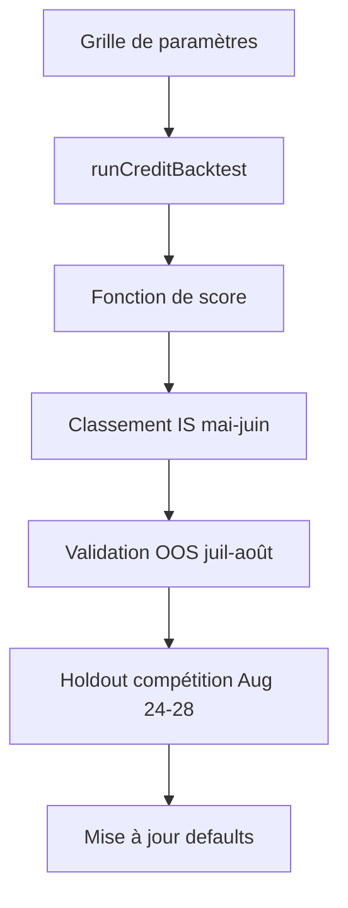

# Optimiser la stratégie credit spreads — approche systématique

## Problème avec l'approche actuelle

Ajuster `stopMultiple` ou `targetProfitPct` à la main dans le panneau UI ne scale pas :

- ~15 paramètres tunables, des interactions non linéaires (stop 3× + choc IV + put side)
- L'échantillon est instable hors échantillon (§7.4 : signe du P&L s'inverse entre mai-juin et juil-août)
- Optimiser sur la période complète = **overfitting garanti** sur 4 mois

Il faut un **harness de sweep** + **validation walk-forward**, pas des A/B manuels.

---

## Architecture proposée



### Fichier à créer

[`scripts/credit-sweep.ts`](scripts/credit-sweep.ts) — script CLI qui :

1. Charge les barres une fois (via `getBarsRange` du client Alpaca, comme le backtest live)
2. Itère sur une grille de paramètres avec `runCreditBacktest(params, { getBarsRange })`
3. Calcule un score composite par run
4. Écrit `artifacts/credit-sweep/{timestamp}/results.json` + `results.csv`

Réutilise l'injection de deps des tests ([`credit-spread.test.ts`](src/server/backtest/credit-spread.test.ts) ligne 58) pour pouvoir aussi tourner en mode mock (rapide) vs live (Alpaca).

---

## Fonction de score

Ne pas optimiser le P&L brut seul. Score proposé :

```
score = expectancy − λ × maxDrawdownPct
```

| Paramètre | Valeur | Raison |
|---|---|---|
| `λ` | 2,0 | Pénalise les configs qui gagnent en moyenne mais explosent en queue |
| Contrainte `trades` | ≥ 30 (IS) | Évite les configs qui gagnent sur 3 trades |
| Contrainte `hitRate` | > `breakEvenHitRate` | Filtre les configs structurellement perdantes |
| Métrique finale | score OOS | La config retenue est celle qui **généralise**, pas celle qui maximise l'in-sample |

**Ne pas optimiser `ivMultiplier`** — c'est une hypothèse (prime de variance), pas un paramètre observable. Le sweep le fixe à 1,15 (calibration doc §7) et fait une **analyse de sensibilité** séparée (1,0 / 1,15 / 1,30) sur la config retenue.

---

## 3 couches de leviers (par ordre)

### Couche 1 — Sorties (déjà explorée manuellement)

Grille initiale — confirmer et affiner l'observation stop 3× :

| Paramètre | Grille |
|---|---|
| `stopMultiple` | 2, 2.5, 3, 3.5, 4 |
| `targetProfitPct` | 0.25, 0.30, 0.35, 0.50, 0.65 |
| `stopSlippagePct` | 0.15, 0.25 (fixé après phase 1) |

~25 combinaisons. Split IS : `2026-05-01 → 2026-06-30`.

### Couche 2 — Structure (nouveau levier principal)

Une fois les meilleurs stops fixés, explorer :

| Paramètre | Grille | Hypothèse |
|---|---|---|
| `targetDelta` | 0.12, 0.15, 0.175, 0.20 | Plus OTM = moins de gamma, moins de stops |
| `minDte` / `maxDte` | (1,2), (1,3), (2,3) | 2 DTE uniquement = plus de theta, plus de risque expiry |
| `sides` | both, put, call | Put est le sink (§7.3) — quantifier |
| `spreadWidth` | 3, 5, 7 | Largeur change le ratio crédit/risque |
| `entryTimeEt` | 10:00, 11:00, 14:00 | Entrer plus tard = moins de temps exposé mais moins de theta |
| `minCredit` | 0.20, 0.25, 0.35 | Filtre IV implicite — skip les jours où la prime est trop basse |

~200 combinaisons (réduire par elimination : garder top-3 deltas × top-2 DTE × 3 sides).

### Couche 3 — Filtres d'entrée (gap actuel, plus gros levier potentiel)

Aujourd'hui la stratégie entre **chaque jour à 10h** sans condition. C'est le plus gros espace d'optimisation non exploité.

Filtres à ajouter dans [`credit-spread-engine.ts`](src/server/backtest/credit-spread-engine.ts) (avant `handleEntry`, ~ligne 441) :

| Filtre | Signal | Status |
|---|---|---|
| **HV20 percentile** | Skip si vol réalisée > 80e percentile sur 20j | Données déjà chargées (`ivByDate`) |
| **Range veille** | Skip si `(high-low)/close` de la veille > 1,5 % | Calculable sur daily bars |
| **Gap d'ouverture** | Skip si `|open - prevClose|/prevClose` > 0,5 % | Barre d'ouverture dispo |
| **Jour de la semaine** | Skip lundi (gap weekend) ou vendredi (theta court) | Trivial |

Nouveaux champs dans `CreditBacktestParamsSchema` :

```typescript
maxHv20Percentile: z.number().min(0).max(1).optional(),  // ex. 0.80
maxPriorRangePct: z.number().min(0).optional(),           // ex. 0.015
maxOpenGapPct: z.number().min(0).optional(),              // ex. 0.005
skipWeekdays: z.array(z.number().int().min(0).max(6)).default([]),
```

Chaque refus alimente `rejections` (ex. `hv_too_high`) — même pattern que `credit_below_min`.

**Pourquoi c'est plus prometteur que de tweaker le stop :** le stop règle *comment* on sort ; le filtre d'entrée règle *quand* on ne devrait pas être dans le trade. Sur 4 mois, éviter 15 % des mauvais jours peut valoir plus qu'un stop à 3× vs 2×.

---

## Validation walk-forward (anti-overfitting)

| Fenêtre | Dates | Rôle |
|---|---|---|
| **In-sample (IS)** | 2026-05-01 → 2026-06-30 | Sweep + classement |
| **Out-of-sample (OOS)** | 2026-07-01 → 2026-08-28 | Valider top-5 configs IS |
| **Holdout compétition** | 2026-08-24 → 2026-08-28 | Test final, ne jamais optimiser dessus |

Règle de sélection : une config n'est retenue que si **score OOS > 0** ET **maxDD OOS < 2× maxDD IS**. Sinon, simplifier (moins de paramètres = moins d'overfitting).

Référence doc §7.4 — le signe s'inverse entre les deux moitiés. Une config qui gagne en IS mais perd en OOS est rejetée, même avec un beau P&L total.

---

## Ce qu'on ne fait PAS

| Approche | Pourquoi |
|---|---|
| Optimiser `ivMultiplier` dans le sweep | Hypothèse non observable — sensitivity analysis seulement |
| Grid search exhaustif 15D | Overfitting + temps de calcul ; sweep par couches |
| Maximiser P&L sans pénalité DD | La queue non testée est le vrai risque (§7.4, §8) |
| Monter le sizing avant validation OOS | `riskPerSidePct` amplifie, ne corrige pas l'edge |

---

## Livrables

1. **`scripts/credit-sweep.ts`** — harness CLI (`pnpm sweep:credit`)
2. **`artifacts/credit-sweep/`** — résultats reproductibles (gitignored)
3. **Mise à jour defaults** dans [`CreditBacktestParamsSchema`](src/domain/backtest-credit.ts) + [`CreditSpreadPanel.tsx`](src/components/backtest/CreditSpreadPanel.tsx)
4. **§7.7 dans [`docs/07-strategie-credit-spreads.md`](docs/07-strategie-credit-spreads.md)** — tableau sweep + config retenue + score IS/OOS
5. **(Optionnel) Filtres d'entrée** dans le moteur si la couche 2 ne suffit pas

---

## Ordre d'exécution

1. Créer le harness de sweep + fonction de score
2. Phase 1 : sweep sorties (IS) → valider stop 3× formellement
3. Phase 2 : sweep structure avec meilleurs stops
4. Validation OOS + holdout
5. Si insuffisant → implémenter filtres d'entrée (couche 3) et re-sweep
6. Mettre à jour defaults et doc
